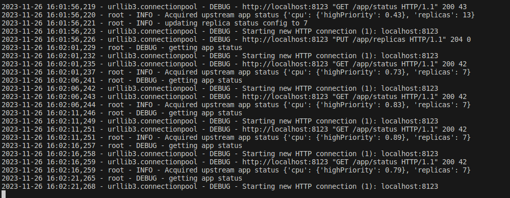
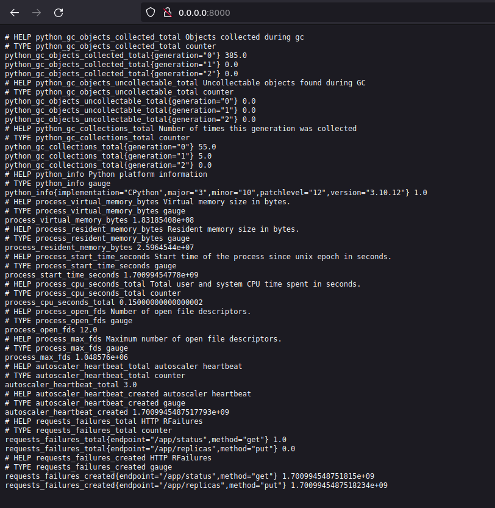
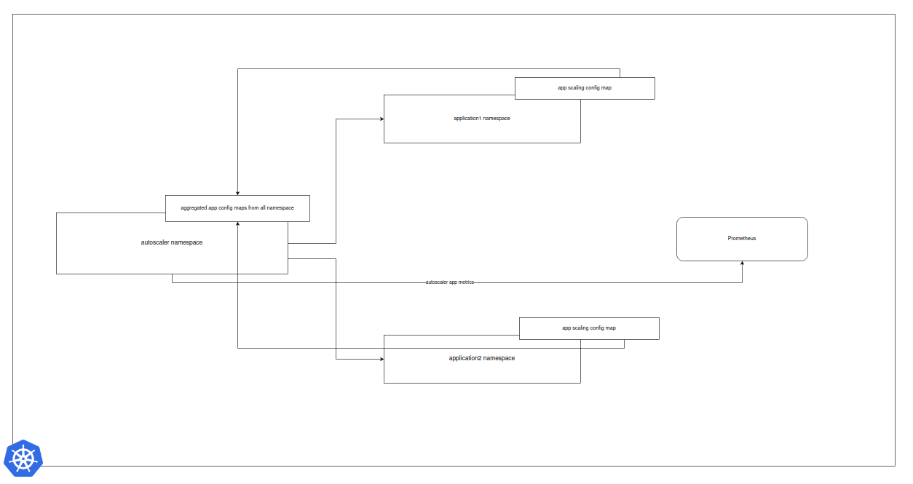

# ScaleIt

## How to Get Started/Setup

### Manual Setup with no containers

1. Start the ScaleIt Server App

```
chmod +x ./bin/scaleit-linux-amd64
./bin/scaleit-linux-amd64
```

2. Setup the python environment

```
python3 -m venv venv
source venv/bin/activate
pip install -r requirements.txt
python app.py
```

- You can check scaleit app on `(default) port 8123`
- and, prometheus metrics on `port 8000`

### Docker Setup

Preferred way to automated setup

```
make setup
```
Grab a coke while the image builds, and when you come back you will find logs being exported. So you will be able to observe the application in execution

```
make run
```
Deploy everything on Docker compose

```
make tests
```
run tests

## Code Walkthrough

### Main Functionality

The autoscaler application is designed to be highly configurable with the assumption that the following endpoints will be available to scale the application

- `app/status` - via GET requests, which reports the application health in the prescribed format as given in the requirements
- `app/replcias` - via PUT request which allows to update the application replicas

The following parameters have been configured in the Application via environment variables and env file:

-  `APP_SERVICE_URL` - URL of the Autoscaler app
-  `APP_SERVICE_PORT`- Port to which the app is bound
-  `SCALE_RESOLUTION_TIME` - The grain/period at which the application will be checked for scaling
-  `SCALE_METRIC` - The expected metric value to be retained
-  `SCALE_TOLERANCE` - Tolerance value till which we do not require scaling to kick in, default is at .1
-  `LOG_LEVEL` - log level of the application, default is INFO



### Observability

We also have Prometheus Observability integration and the logs can be observed at `port 8000`

We have the following metrics being exported:

- `autoscaler_heartbeat` : this metric can be used to monitor autoscaler status
- `requests_failures` : this metrics has the labels `['method', 'endpoint']` and can be used to track request failures at the scaleit application endpoints



## How to do things differently in Production

### Revamp architecture to Scale multiple apps cluster wide
The current setup is a simple python application, and makes the assumption that there's only 1 application which needs to autoscaled. I see immense potential in deploying an evolved version of this application by means of a Kubernetes Operator.

In production grade development:
- Revise the application design to monitor/deploy for more than 1 application - we can use async calls while we wait on the Scaling Resolution Time
- The configuration of the different applications (to be monitored) can be deployed in the application deployment namespace
- A customised K8s operator can watch for the config CRD's which it can collect and feed to the main autoscaler application
- The autoscaler application can then be scaled to watch/scale the deployed applications

### Other improvements

- Observability: Currently we integrated prometheus metrics directly, a batter option would have been to use Open Telemetry which is compatible with a wider range of tooling

-  Programming Language: Given more time, Golang is better suited for such kind of projects rather than python

- Helm Chart: Helm Chart to dpeloy the entire setup on K8s

### Self Management
The autoscaler app can be made to watch itself so that it may handle the load capacity, and service accordingly

### Production System Diagram

